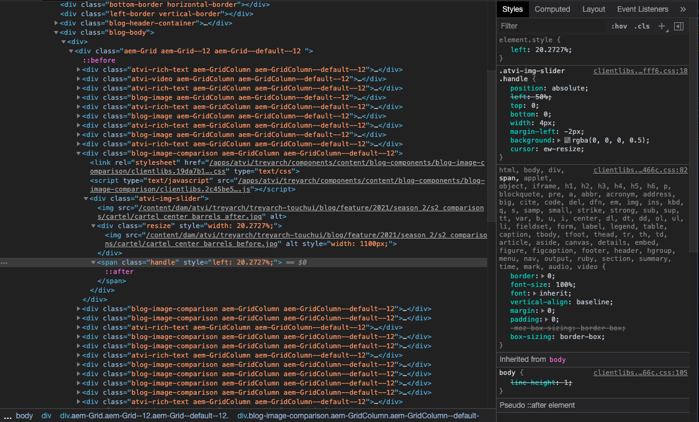

#  Before/After Image Slider 

The goal here is to get a draggable slider bar to reveal either a before image or after image based on it's location on the image pane. 

eg: the sliders found down the page of these COD: Cold War patch notes: 

https://www.treyarch.com/game-intel/2021/02/Season_Two_Details_and_Patch_Notes 

### screenshots (in case that link breaks)
The area to the left of the slider is the before picture (as indicated by the div at the bottom left). To the right of the slider is the after picture. 

## How it works 

The before image is placed on top of the after image, and the slider adjusts the size of before image pane. On the CSS, the image's position and size is absolute, and its overlow is set to hidden. So, if the div containing the image as its background is smaller than the image's size, parts of the image won't be visible. The slider adjusts how big this div is. 

